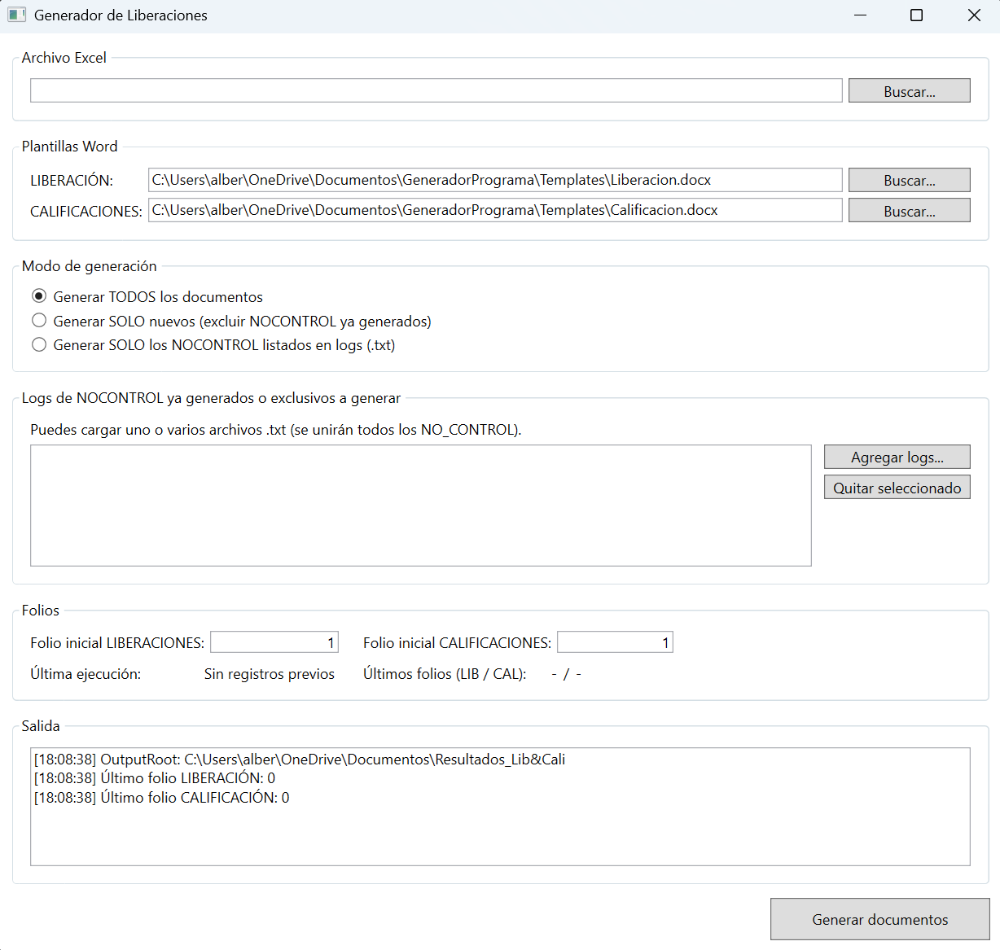
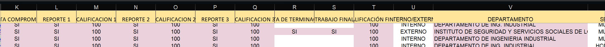
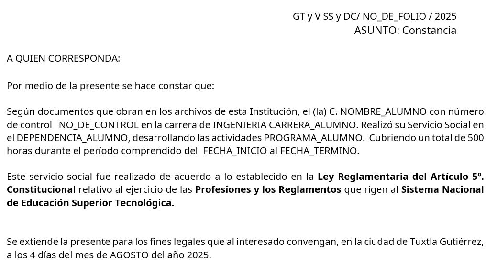
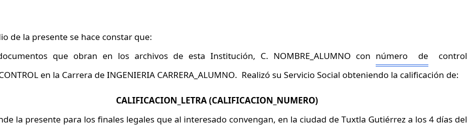

# Generador de Liberaciones y Calificaciones

**GeneradorLiberaciones** es una solución de escritorio robusta diseñada para automatizar la expedición masiva de documentos oficiales en instituciones educativas (enfocado en el modelo de Institutos Tecnológicos). 

Este sistema elimina la carga administrativa de llenar manualmente **Cartas de Liberación de Servicio Social** y **Actas de Calificación**, procesando cientos de registros desde un Excel en segundos, validando la integridad de los datos y generando documentos PDF listos para firma.

---

## Vista Previa del Sistema

---

## Características Principales

- **Procesamiento Masivo por Carrera:** Capacidad de leer múltiples pestañas de un archivo Excel, deduciendo automáticamente la carrera del alumno según el nombre de la hoja.
- **Motor de Plantillas Dinámico:** Utiliza archivos Word (`.docx`) como base. Puedes modificar el diseño, sellos o logotipos de tus documentos sin necesidad de tocar el código fuente.
- **Validación de Reglas de Negocio:**
    - **Formato de Folio:** Control secuencial y persistente de la numeración de documentos.
    - **Integridad de Datos:** Valida que el No. de Control sea correcto y que los periodos de servicio cumplan con la normativa de 6 meses exactos.
    - **Normalización:** Corrige errores comunes de captura en nombres de carreras y programas (ej. "Mecainca" -> "Mecánica").
- **Conversión Fiel a PDF:** Implementa una integración *headless* con LibreOffice para asegurar que el PDF generado mantenga el formato exacto de la plantilla original.
- **Auditoría y Logs:** Genera reportes de éxito y archivos de errores detallados para identificar rápidamente registros con fechas inválidas o datos incompletos.

---

## Requisitos Técnicos

### Software Necesario
1. **.NET 9.0 Runtime:** Necesario para ejecutar la aplicación.
2. **LibreOffice (Versión 7.0+):** Indispensable para la conversión de documentos Word a PDF.
   - El sistema busca `soffice.exe` en la ruta por defecto: `C:\Program Files\LibreOffice\program`.

### Estructura del Excel
El sistema espera un archivo `.xlsx` con columnas específicas para funcionar correctamente.

(assets/excel_format2.png)

---

## Guía de Uso Rápido

### 1. Preparación de Plantillas
Crea tus documentos en Word utilizando los siguientes "placeholders" donde desees que aparezca la información:

| Placeholder | Descripción |
| :--- | :--- |
| `{{NOMBRE_ALUMNO}}` | Nombre completo del estudiante |
| `{{NO_DE_CONTROL}}` | Matrícula del alumno |
| `{{CARRERA_ALUMNO}}` | Carrera (deducida de la pestaña del Excel) |
| `{{NO_DE_FOLIO}}` | Número de folio asignado |
| `{{FECHA_INICIO}}` | Fecha de inicio del periodo |
| `{{FECHA_TERMINO}}` | Fecha de finalización del periodo |
| `{{CALIFICACION_LETRA}}` | Promedio convertido a texto (ej: "NOVENTA Y CINCO") |

### 2. Configuración en la App
1. Selecciona el **Archivo Excel** con la base de datos de los alumnos.
2. Define el **Folio Inicial** (el sistema recordará el último folio utilizado para la siguiente ejecución).
3. Selecciona las rutas de tus plantillas de Liberación y Calificación.
4. Presiona **Generar** y los resultados aparecerán en tu carpeta de `Documentos/Resultados_Lib&Cali`.

---

## Interpretación de Errores

Si un registro no genera documento, el sistema creará un archivo `ErroresGeneracion_...txt` con los siguientes códigos:
- **Error 1:** El periodo entre inicio y término NO es de exactamente 6 meses.
- **Error 2:** El nombre del Programa no está dentro de los permitidos (Soporte, Asistencia, etc.).
- **Error 3:** El Número de Control tiene un formato inválido.
- **Error 4:** Alguna de las fechas es nula o ilegible.

---

## Arquitectura del Proyecto

- **`GeneradorLiberaciones.Core`**: Biblioteca de lógica pura. Contiene el `ExcelReader`, el `TemplateEngine` y el servicio de validación.
- **`GeneradorLiberaciones.Wpf`**: Interfaz de usuario moderna y fluida que gestiona la configuración del usuario y la persistencia de datos en `Folios.json`.

---

## Contribuciones

Si deseas mejorar este proyecto o adaptarlo a los requerimientos de tu institución:
1. Haz un Fork del repositorio.
2. Crea una rama para tu mejora: `git checkout -b feature/NuevaValidacion`.
3. Envía un Pull Request detallando los cambios.

---
Desarrollado para optimizar los procesos administrativos educativos.
